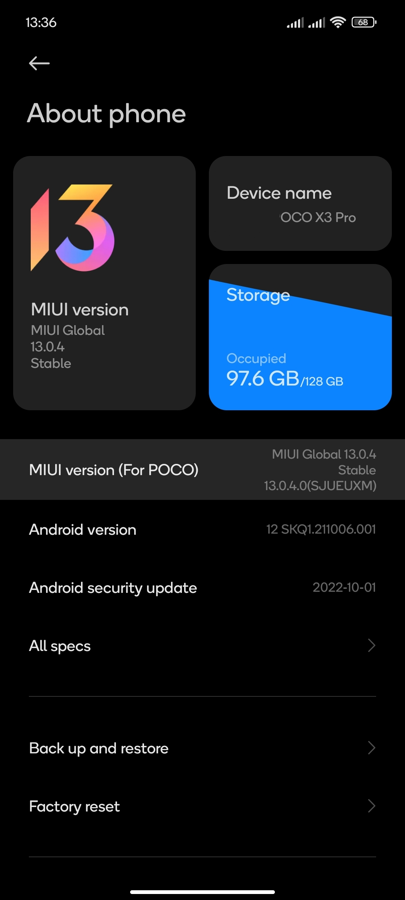
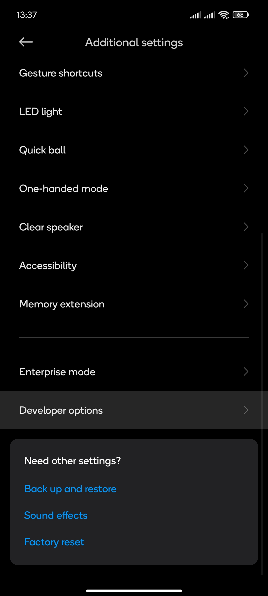
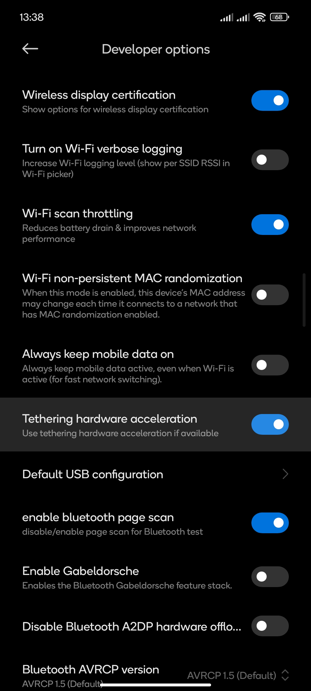
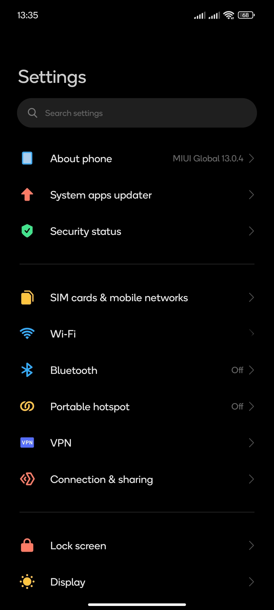
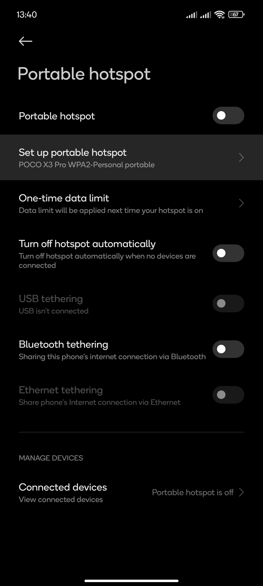

# Use an existing device as a WiFi extender

I was browsing Amazon recently for new Ethernet only powerline adaptors and I was pretty shocked that they were like £35 for a starter kit, for not even gigabit support at times, imagine how much more a WiFi enabled extender costs? But, with this guide today, you won't have to worry and you can use an old laptop or smartphone as a WiFi extender.

## Requirements

- Windows 10 or newer with a WiFi adaptor (apparently 8.1 has support but I've never been able to find it)
- Android smartphone, version unknown (cannot guarantee support)

## Guide

### Windows

Windows is going to be the easiest to do here, since we don't have the complications of different operating system skins. Windows 10 or newer is required here to the best of my ability.

1. Turn on your computer and make sure it's connected to the internet (doesn't matter whether it's 4G, WiFi or Ethernet, as long as you have a WiFi adaptor in your PC)
2. Open Settings
3. Go to Network and internet
4. Go to the mobile hotspot menu
5. Set the hotspot to never turn off
6. Make sure the hotspot shares the internet connection from the correct device through the WiFi dongle
7. Specify WiFi frequency that you want to use (2.4GHz is more polluted and will give slower speeds but longer range and more compatibility, 5GHz provides fast speeds and is less polluted but less compatibility and range)
8. Config the name and password for your WiFi extender (e.g. Home-ext with the same password as your main network)
9. Turn on extender and connect your devices

### Android (Huawei)

I'm hoping this is still a feature in newer Huawei devices, this guide is based from memory of a Honor 9 Lite running EMUI 9. Should hopefully be accurate, the device I used had 2.4GHz support only, if there's a frequency toggle in supported devices, then follow my advice for frequency selection in Windows.

1. Turn on your device and open Settings
2. Go to WiFi
3. Go to tethering and internet
4. a Go to WiFi Bridge
4. b (If you're extending data) Go to WiFi tethering
5. Configure your networks name and password
6. Set the hotspot/WiFi bridge to never turn off
7. Turn on hotspot/WiFi bridge

### Android (other skins)

I don't know how widespread this is, I could have sworn that this was a developer options setting you had to turn on, but perhaps it stopped? Either way, I'd recommend checking that your cellular provider supports using data for tethering in case your device uses data instead of WiFi, or in the case your WiFi goes down and you've left the mobile data toggle on.

Information may not be accurate for your device to a lack of consistency between skins, my guide is mainly based around a Xiaomi device.

1. Turn on your device and open Settings
2. (Skip if developer options are enabled) Go to about device and press build number 7 times (MIUI version for Xiaomi devices)
  
3. Go back and find developer options (for Xiaomi devices, it's in additional settings > developer options)
  
4. Enable tethering hardware acceleration if it isn't enabled
  
5. Go back to the main screen and find portable hotspot or tethering (idk whether my device pinned it, you might need to look in Connection and sharing (Xiaomi) or WiFi for it)
  
6. Set up portable hotspot
  
7. Configure your networks name and password
8. Press select AP band and use 2.4GHz or 5GHz depending on your needs
9. Go back and switch off turn off hotspot automatically 
10. Turn on your hotspot!

---

Please share with your friends, thanks!

---

ExperiencersInternational © 2023
